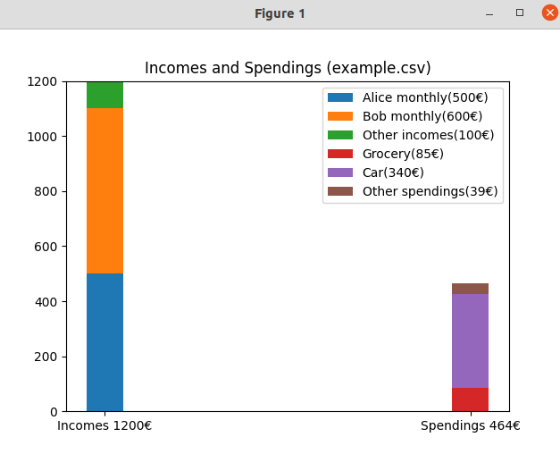
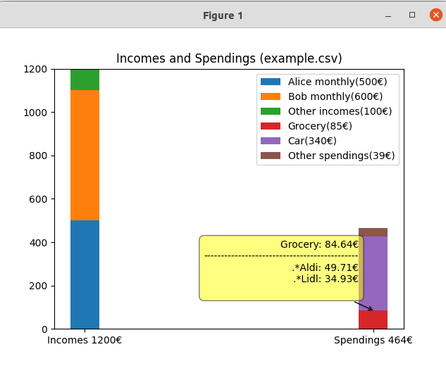

# spendings
A python script to analyze incomes and spendings from my bank account (csv export). 

Categories for Incomes and Spendings can be easily configured, as well as the text patterns for matching to any category. Hovering the mouse on any category shows more detailed information where your money went (or came from).

